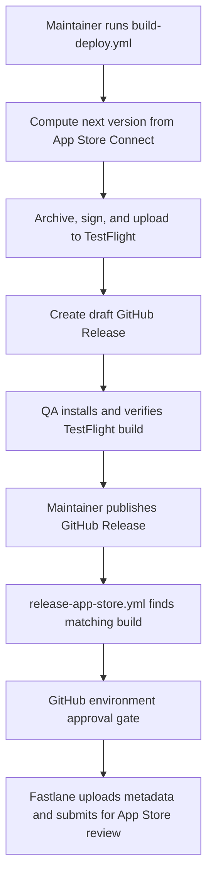

# riddim-release

Reusable release infrastructure for Riddim apps and websites.

`riddim-release` packages the release work every app or website repo used to
own itself: GitHub Actions workflows, Fastlane lanes, App Store Connect scripts,
Amplify website deploy helpers, runner helpers, adoption templates, and
operational docs. Consuming repos copy thin workflow shims and app-specific
scaffolding, then call the stable reusable workflows from this repo.

The intended result is boring release operations:

- create a TestFlight build from GitHub Actions
- generate a draft GitHub Release as the QA gate
- publish that Release to submit the matching build to App Store review
- push App Store metadata without shipping a binary
- keep runner selection centralized in repository variables
- deploy website PR previews and promote the exact approved artifact to
  production behind a GitHub Environment approval gate

## Status

`v1` is the stable adoption line. Production consumers should pin reusable
workflows and Fastlane imports to `@v1`, not `@main`.

The moving `v1` tag tracks the latest non-breaking v1.x.y release. Breaking
workflow, template, or lane contract changes require a new major tag.

## Contents

- [Who This Is For](#who-this-is-for)
- [Get Started](#get-started)
- [How Releases Work](#how-releases-work)
- [What This Repo Provides](#what-this-repo-provides)
- [Configuration Reference](#configuration-reference)
- [Repository Map](#repository-map)
- [Operating the System](#operating-the-system)
- [Local Development](#local-development)
- [Security Model](#security-model)
- [Troubleshooting](#troubleshooting)
- [Support](#support)
- [License](#license)

## Who This Is For

Use this repo when you maintain a Riddim iOS app or static website and want the
shared release pipeline instead of rebuilding release automation in each repo.

For iOS apps, this repo assumes the app already has:

- an Xcode project that builds locally; workspace-based apps may need
  app-specific Fastlane adjustments
- an App Store Connect app record
- access to the Riddim Apple Developer team
- GitHub Actions enabled
- AWS access to the release secrets account
- either GitHub-hosted macOS minutes or a repo-scoped self-hosted macOS runner

For websites, this repo assumes the site already has an AWS Amplify app and
GitHub OIDC roles for preview and production deployments.

This repo is not an installed CLI. The primary user surface is GitHub Actions.
The Python and shell files under `scripts/` are script-style tools used by those
workflows and can also be run manually by maintainers.

## Get Started

For the complete onboarding runbook, use [docs/adopt.md](docs/adopt.md). The
short path below is the front-door checklist for a new app.

Local setup commands assume `gh` is installed and authenticated, plus `curl`,
`openssl`, and Ruby. Use the full adoption guide for AWS and App Store Connect
lookup tooling.

### 1. Choose the consuming app values

Set these locally before running setup commands:

```bash
export OWNER=sunnypurewal
export REPO=your-app
export GH_REPO="$OWNER/$REPO"

export APPLE_APP_ID=1234567890
export BUNDLE_ID=com.riddimsoftware.yourapp
export TEAM_ID=ZG82TFXU3C
export SCHEME=YourApp
export IOS_WORKDIR=ios
export XCODEPROJ_PATH=YourApp.xcodeproj
export PRIMARY_LOCALE=en-US
export AWS_RELEASE_ROLE_ARN=arn:aws:iam::<account-id>:role/github-appstore-release
```

If you do not know `APPLE_APP_ID`, query it with the App Store Connect steps in
[docs/adopt.md](docs/adopt.md#query-apple_app_id).

### 2. Set required GitHub variables

```bash
gh variable set APPLE_APP_ID        --repo "$GH_REPO" --body "$APPLE_APP_ID"
gh variable set BUNDLE_ID           --repo "$GH_REPO" --body "$BUNDLE_ID"
gh variable set TEAM_ID             --repo "$GH_REPO" --body "$TEAM_ID"
gh variable set SCHEME              --repo "$GH_REPO" --body "$SCHEME"
gh variable set XCODEPROJ_PATH      --repo "$GH_REPO" --body "$XCODEPROJ_PATH"
gh variable set IOS_WORKDIR         --repo "$GH_REPO" --body "$IOS_WORKDIR"
gh variable set PRIMARY_LOCALE      --repo "$GH_REPO" --body "$PRIMARY_LOCALE"
gh variable set EXTRA_BUNDLE_IDS    --repo "$GH_REPO" --body ""
gh variable set RIDDIM_RELEASE_REF  --repo "$GH_REPO" --body v1
```

Set the runner profile. Current v1 templates force self-hosted macOS runners
unless a consuming shim explicitly passes `force_self_hosted: false`, so the
self-hosted profile is the active default:

```bash
gh variable set RUNNER_PROFILE      --repo "$GH_REPO" --body self-hosted
gh variable set RUNNER_LABELS_MAC   --repo "$GH_REPO" --body '["self-hosted","macOS"]'
gh variable set RUNNER_LABELS_LINUX --repo "$GH_REPO" --body '["self-hosted","macOS"]'
```

Hosted labels are retained for repos that deliberately opt out of forced
self-hosted execution in their shims:

```bash
gh variable set RUNNER_PROFILE      --repo "$GH_REPO" --body hosted
gh variable set RUNNER_LABELS_MAC   --repo "$GH_REPO" --body '["macos-15"]'
gh variable set RUNNER_LABELS_LINUX --repo "$GH_REPO" --body '["ubuntu-latest"]'
```

### 3. Set required GitHub secrets

```bash
gh secret set AWS_RELEASE_ROLE_ARN --repo "$GH_REPO" --body "$AWS_RELEASE_ROLE_ARN"
openssl rand -base64 32 | gh secret set KEYCHAIN_PASSWORD --repo "$GH_REPO"
```

Because `RiddimSoftware/riddim-release` is private, consuming repos also need a
token that can read this repo:

```bash
gh secret set RIDDIM_RELEASE_TOKEN --repo "$GH_REPO" --body "$RIDDIM_RELEASE_TOKEN"
```

Optional integrations:

```bash
gh secret set SLACK_RELEASES_WEBHOOK --repo "$GH_REPO"
gh secret set SENTRY_DSN             --repo "$GH_REPO"
gh secret set SENTRY_AUTH_TOKEN      --repo "$GH_REPO"
gh secret set SENTRY_ORG             --repo "$GH_REPO"
gh secret set SENTRY_PROJECT         --repo "$GH_REPO"
```

### 4. Copy the app-facing templates

From the consuming app repo:

```bash
export RIDDIM_RELEASE_REF=v1
export RIDDIM_RELEASE_TOKEN=<token-with-read-access-to-riddim-release>

mkdir -p .github/workflows "$IOS_WORKDIR/fastlane"

for file in \
  build-deploy.shim.yml \
  release-app-store.shim.yml \
  deliver-metadata.shim.yml \
  budget-watcher.yml
do
  target="${file/.shim/}"
  curl -fsSL \
    -H "Authorization: Bearer $RIDDIM_RELEASE_TOKEN" \
    "https://raw.githubusercontent.com/RiddimSoftware/riddim-release/$RIDDIM_RELEASE_REF/templates/workflows/$file" \
    -o ".github/workflows/$target"
done

for file in Fastfile Appfile.erb Deliverfile.erb Snapfile.erb Pluginfile; do
  curl -fsSL \
    -H "Authorization: Bearer $RIDDIM_RELEASE_TOKEN" \
    "https://raw.githubusercontent.com/RiddimSoftware/riddim-release/$RIDDIM_RELEASE_REF/templates/fastlane/$file" \
    -o "$IOS_WORKDIR/fastlane/$file"
done

curl -fsSL \
  -H "Authorization: Bearer $RIDDIM_RELEASE_TOKEN" \
  "https://raw.githubusercontent.com/RiddimSoftware/riddim-release/$RIDDIM_RELEASE_REF/templates/fastlane/Gemfile" \
  -o "$IOS_WORKDIR/Gemfile"
```

Render the ERB Fastlane files and add metadata folders as shown in
[docs/adopt.md](docs/adopt.md#3-repo-scaffolding).

Commit and push the copied workflows and Fastlane scaffold before running the
first dry run:

```bash
git add .github "$IOS_WORKDIR"
git commit -m "Adopt riddim-release"
git push
```

### 5. Create the approval environment

```bash
gh api --method PUT \
  "repos/$GH_REPO/environments/app-store-release" \
  --field wait_timer=0
```

Then add required reviewers in GitHub:

`Settings -> Environments -> app-store-release -> Required reviewers`

### 6. Run the first dry run

```bash
gh workflow run build-deploy.yml \
  --repo "$GH_REPO" \
  -f bump=patch \
  -f dry_run=true

gh run watch --repo "$GH_REPO" \
  "$(gh run list --repo "$GH_REPO" --workflow build-deploy.yml --json databaseId --jq '.[0].databaseId')"
```

Success means GitHub Actions computed the next App Store version and verified
the workflow wiring without signing, archiving, uploading, or creating a draft
release.

### 7. Run the first real build

```bash
gh workflow run build-deploy.yml \
  --repo "$GH_REPO" \
  -f bump=patch \
  -f dry_run=false
```

When the run succeeds, the app should have:

- a new TestFlight build
- a draft GitHub Release named for the computed version
- optional Slack notification that QA can start

Publish the draft GitHub Release after QA approves the TestFlight build. That
publication triggers `release-app-store.yml`, pauses at the
`app-store-release` environment, and submits to App Store review after approval.

## How Releases Work



The draft GitHub Release is the human QA gate. The App Store submission workflow
does not choose an arbitrary latest build; it resolves the release tag, finds a
TestFlight build with the matching marketing version, and submits that build.

## What This Repo Provides

### Reusable workflows

| Workflow | Called by consumers as | Purpose |
| --- | --- | --- |
| `.github/workflows/build-deploy.yml` | `build-deploy.yml` shim | Compute version, upload TestFlight build, create draft GitHub Release |
| `.github/workflows/release-app-store.yml` | `release-app-store.yml` shim | Submit the release-tagged TestFlight build to App Store review |
| `.github/workflows/deliver-metadata.yml` | `deliver-metadata.yml` shim | Push App Store listing metadata without uploading a binary |
| `.github/workflows/website-preview.yml` | `website-preview.yml` shim | Deploy an Amplify preview branch for a website PR |
| `.github/workflows/website-promote.yml` | `website-promote.yml` shim | Promote the exact preview artifact to the production Amplify branch |
| `.github/workflows/website-cleanup.yml` | `website-cleanup.yml` shim | Delete an abandoned website preview branch |
| `.github/workflows/sprint-autopilot.yml` | Used in this repo | End a completed Jira sprint and start the next one when work is clear |

### Shared Fastlane lanes

Consumers import [fastlane/Fastfile](fastlane/Fastfile) from this repo through
their copied `ios/fastlane/Fastfile`.

The shared lanes handle:

- version and build number updates
- archive creation
- TestFlight upload
- metadata delivery
- App Store submission support

### Scripts

| Path | Purpose |
| --- | --- |
| `scripts/release/` | App Store Connect version lookup, build selection, release notes, evidence verification |
| `scripts/runner/` | AWS secret fetchers and ephemeral keychain setup |
| `scripts/marketing/` | ASO baseline and App Preview helper scripts |
| `scripts/jira/` | Jira sprint autopilot |

## Configuration Reference

### Required variables in consuming app repos

| Variable | Example | Notes |
| --- | --- | --- |
| `APPLE_APP_ID` | `1234567890` | Numeric App Store Connect app ID |
| `BUNDLE_ID` | `com.riddimsoftware.example` | Primary bundle identifier |
| `TEAM_ID` | `ZG82TFXU3C` | Apple Developer team |
| `SCHEME` | `ExampleApp` | Xcode scheme to archive |
| `XCODEPROJ_PATH` | `ExampleApp.xcodeproj` | Project path relative to `IOS_WORKDIR` |
| `IOS_WORKDIR` | `ios` | Directory containing Fastlane files |
| `PRIMARY_LOCALE` | `en-US` | App Store metadata locale |
| `RUNNER_PROFILE` | `self-hosted` | Human-readable runner mode |
| `RUNNER_LABELS_MAC` | `["self-hosted","macOS"]` | JSON array for macOS jobs |
| `RUNNER_LABELS_LINUX` | `["self-hosted","macOS"]` | JSON array for Linux jobs |
| `RIDDIM_RELEASE_REF` | `v1` | Shared framework ref to check out |

### Optional variables

| Variable | Purpose |
| --- | --- |
| `EXTRA_BUNDLE_IDS` | Space-separated `bundle_id=target_name` pairs for extensions or App Clips |
| `HAS_APP_CLIP` | Set to `true` when the app includes an App Clip |
| `APPROVAL_ENVIRONMENT` | Override the default `app-store-release` environment |

### Required secrets in consuming app repos

| Secret | Purpose |
| --- | --- |
| `AWS_RELEASE_ROLE_ARN` | AWS role assumed through GitHub OIDC |
| `KEYCHAIN_PASSWORD` | Temporary keychain password for signing jobs |
| `RIDDIM_RELEASE_TOKEN` | Read token for this private repo |

### Optional secrets

| Secret | Purpose |
| --- | --- |
| `RUNNER_BUDGET_PAT` | Budget watcher token for reading billing and writing runner variables |
| `SLACK_RELEASES_WEBHOOK` | Post a build-ready-for-QA Slack message |
| `SENTRY_DSN`, `SENTRY_AUTH_TOKEN`, `SENTRY_ORG`, `SENTRY_PROJECT` | Sentry release integration and dSYM upload |
| `JIRA_EMAIL`, `JIRA_API_TOKEN` | Jira sprint autopilot credentials |

### Repo-internal automation variables

These are used by `riddim-release` itself, not by normal consuming app
adoption:

| Variable | Purpose |
| --- | --- |
| `SPRINT_AUTOPILOT_ENABLED` | Enable scheduled Jira sprint autopilot |
| `SPRINT_AUTOPILOT_DRY_RUN` | Keep scheduled sprint autopilot read-only |
| `JIRA_BASE_URL` | Jira site URL for sprint autopilot |
| `JIRA_BOARD_ID` | Jira Software board ID for sprint autopilot |
| `NEXT_SPRINT_DURATION_DAYS` | Fallback length when starting an undated future sprint |

## Repository Map

```text
.github/workflows/   Reusable workflows and repo self-tests
fastlane/            Shared Fastfile and helper code
scripts/release/     App Store Connect release helpers
scripts/jira/        Jira sprint autopilot
scripts/marketing/   ASO and App Preview tools
scripts/runner/      Runner-side AWS and keychain helpers
templates/           Files copied into consuming app repos
docs/                Adoption, provisioning, runner, and ops guides
```

## Operating the System

### Common release commands

Start a dry run:

```bash
gh workflow run build-deploy.yml --repo "$GH_REPO" -f bump=patch -f dry_run=true
```

Create a real TestFlight build:

```bash
gh workflow run build-deploy.yml --repo "$GH_REPO" -f bump=patch -f dry_run=false
```

Publish the generated draft Release when QA passes:

```bash
gh release edit v<version> --repo "$GH_REPO" --draft=false
```

Rerun App Store submission for a tag without submitting:

```bash
gh workflow run release-app-store.yml \
  --repo "$GH_REPO" \
  -f tag=v<version> \
  -f dry_run=true
```

### Runner selection

Runner selection is centralized in repo variables. Current v1 shims force the
self-hosted macOS path unless a consuming repo intentionally passes
`force_self_hosted: false` to the reusable workflows. See
[docs/runner-setup.md](docs/runner-setup.md) for registering a repo-scoped
macOS runner and [docs/budget-watcher.md](docs/budget-watcher.md) for the
budget-aware runner switcher.

### App Store metadata

Metadata lives in the consuming app repo under:

```text
ios/fastlane/metadata/<locale>/
ios/fastlane/screenshots/<locale>/
ios/fastlane/app-previews/<locale>/
```

Changes to metadata can be pushed independently through
`deliver-metadata.yml`. Screenshots and app previews are covered in
[docs/aso-playbook.md](docs/aso-playbook.md).

### Sprint autopilot

This repo includes a scheduled/manual Jira sprint autopilot that checks whether
all sprint issues are done and whether the repo has no open PRs. If both are
true, it closes the active sprint and starts the next future sprint. See
[docs/sprint-autopilot.md](docs/sprint-autopilot.md).

## Local Development

Run focused tests:

```bash
python3 -m unittest discover -s scripts/jira -p 'test_*.py'
python3 -m unittest discover scripts/release
```

Validate workflow syntax when `actionlint` is installed:

```bash
actionlint .github/workflows/*.yml
```

The release tests include live App Store Connect coverage. If ASC credentials
are not configured locally, run the focused unit test files that do not require
live credentials.

## Security Model

- GitHub Actions assumes AWS roles through OIDC; long-lived AWS keys should not
  be stored in app repos.
- App Store Connect API material is stored in AWS Secrets Manager for release
  workflows.
- Signing certificates are fetched at runtime and imported into an ephemeral
  keychain.
- The private `riddim-release` checkout uses a narrow read token where possible.
- Draft GitHub Releases and GitHub Environments provide human approval gates
  before App Store submission.

Provisioning details:

- [docs/aws-provisioning.md](docs/aws-provisioning.md)
- [docs/asc-provisioning.md](docs/asc-provisioning.md)

## Troubleshooting

| Symptom | Most likely cause | Where to look |
| --- | --- | --- |
| Reusable workflow cannot check out `riddim-release` | Missing or under-scoped `RIDDIM_RELEASE_TOKEN` | Consuming repo secrets |
| Version computation fails | ASC API secret missing, wrong app ID, or no live app record | `compute-version` job logs |
| Build signs locally but not in Actions | Distribution certificate secret, keychain setup, or bundle ID mismatch | `build-upload` job logs |
| No TestFlight build found for a release tag | Release tag version does not match a valid TestFlight build | `release-app-store.yml` `find-build` job |
| Workflow waits before submission | GitHub environment approval is required | `app-store-release` environment |
| Jobs use the wrong runner | `RUNNER_LABELS_MAC` or `RUNNER_LABELS_LINUX` has stale JSON | Repo variables and budget watcher logs |
| Metadata delivery changes more than expected | Fastlane metadata tree contains stale files | `ios/fastlane/metadata` and `deliver` logs |

## Support

Start with the docs closest to the task:

- App adoption: [docs/adopt.md](docs/adopt.md)
- AWS setup: [docs/aws-provisioning.md](docs/aws-provisioning.md)
- App Store Connect setup: [docs/asc-provisioning.md](docs/asc-provisioning.md)
- Runner setup: [docs/runner-setup.md](docs/runner-setup.md)
- Budget watcher: [docs/budget-watcher.md](docs/budget-watcher.md)
- ASO and app previews: [docs/aso-playbook.md](docs/aso-playbook.md)
- Sprint autopilot: [docs/sprint-autopilot.md](docs/sprint-autopilot.md)

For bugs or changes, open a GitHub issue or pull request in this repo and link
the relevant RIDDIM Jira ticket.

## License

MIT. See [LICENSE](LICENSE).
